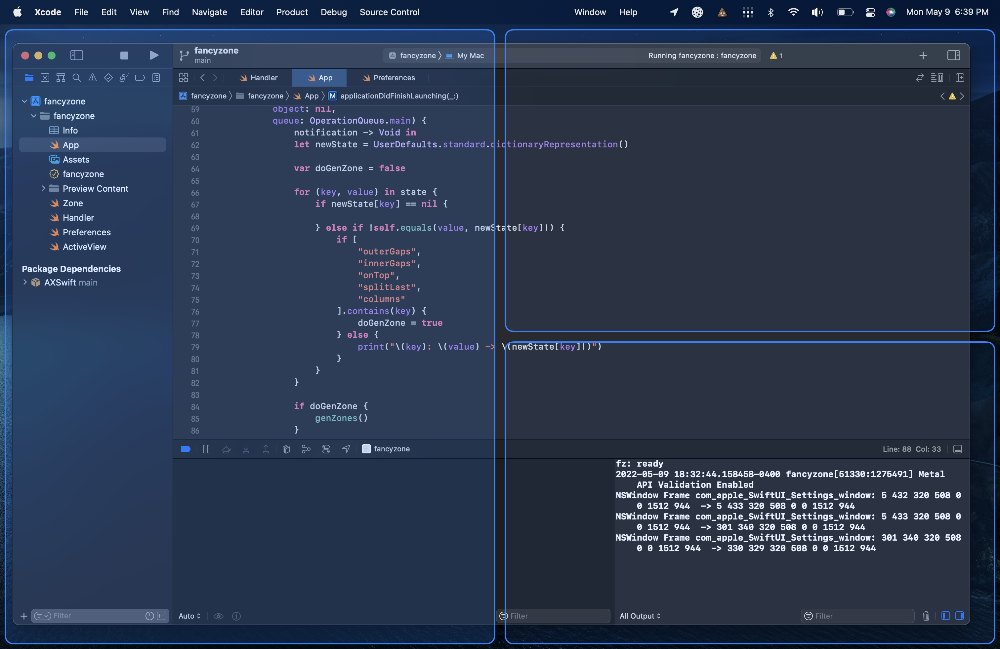

zones
==========
a [fancy zones](https://docs.microsoft.com/en-us/windows/powertoys/fancyzones) clone for macOS

---

---

## how to use

When moving a window, right click or press either `CMD` key to trigger the zone overlay. Once you've moved your cursor into a zone you want to resize your window into, release left click and it should be resized. Releasing the left click in between two zones will resize the window into both of them.

_fixed in v1.4.0_ ~~_**note:** resizing of some windows may not work due to weird implementations of their window, or they have a minimum size requirement that is greater than the size of the zone you're trying to use_~~
